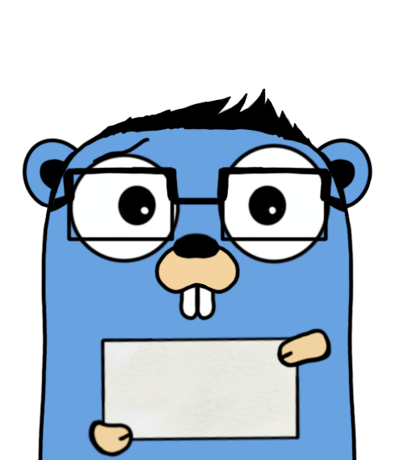

# Bytesize Blogs

A lightweight blog website creator.

---
## Getting Started

To start the server, run 

```bash
go mod download
```

Next, start the node development server...

```bash
bash ./start.sh
```

This will create all your development dependencies and will start the local dev server.


> ^^ the really cool mascot